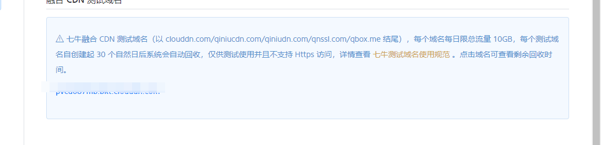
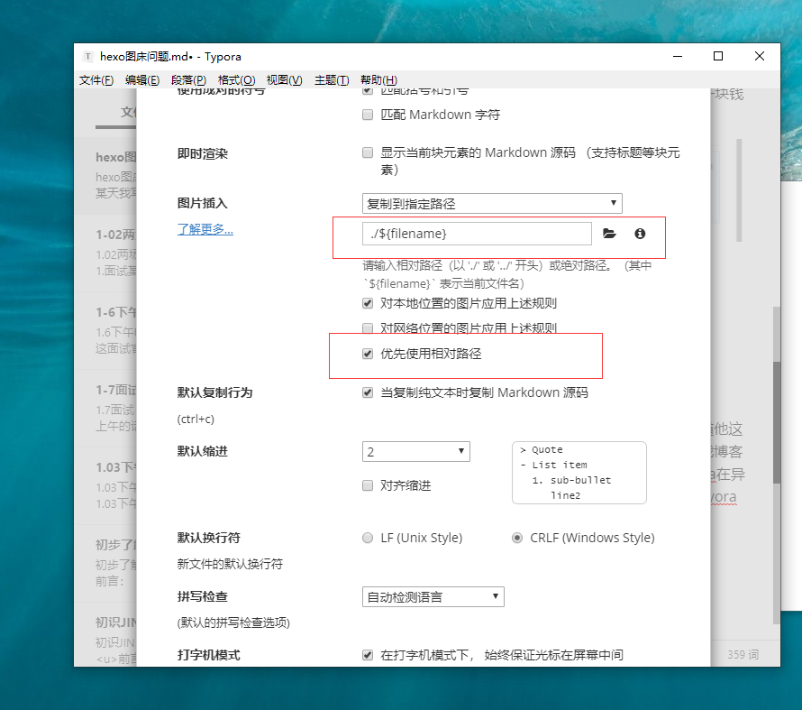
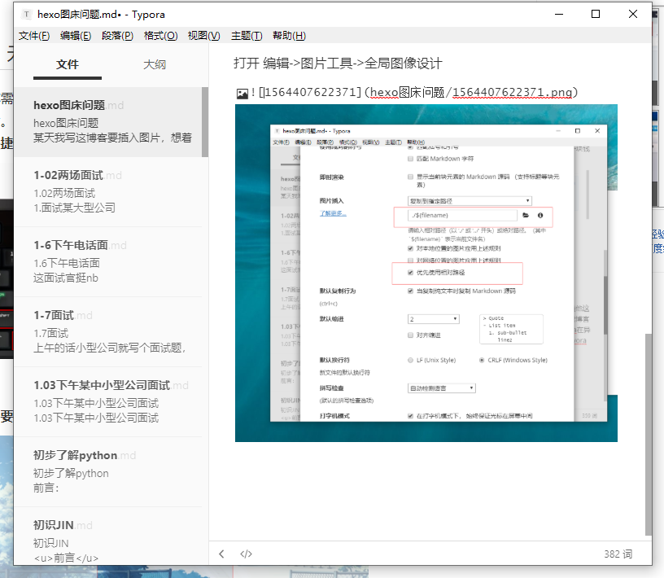
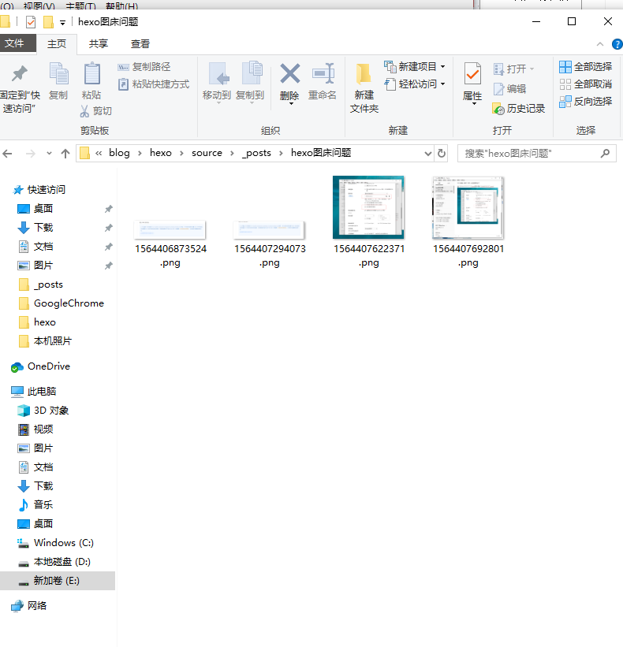

某天我写这博客要插入图片，想着自生配置的解决图片问题的npm hexo-asset-image 插件，原理就是hexo开启绝对路径，然后下载此组件new一个博客给你自动创一个文件夹放图片，我操我要加图片的时候感觉很麻烦，去外面了解一圈，实践了一波.

### 1.七牛云对象储存

第一个沙雕的地方，国内厂商页面访问加载慢的一批。我服，我挂tmvpn去访问操作。

第二云储存50g够用了，但是域名只给你用一个月 我** 行 我一块钱买一个域名吧，尼玛要备案，玩不起是不是？？？结束再见！

### 2.各种图床

我不想列举了 太多了 说一个我心就抽搐一次

### 3.问题分析

 出发点是为了快捷，然而图床出现的新问题是 你他妈怎么知道他这个服务器哪天崩了 信全球著名？ 不好意思我信我自己；第一我博客之前配置的这个方式差的只是一个便捷 现在已经解决使用tyora在异界配置了  hexo-asset-image的前提下，自己摸索配置了一下tyora

打开 编辑->图片工具->全局图像设计

ctrl+alt+a快捷键直接复制 效果如图

卧槽，这么简单，可以我是服了。

还有一个问题，安全性？ 我提交文章，再丢远程分支 , 你跟我说github炸了，我也炸了,不用想了.

再看一下这个效果 ctrl+alt +a 复制的图片自动复制到了这个文章的文件夹

完事~