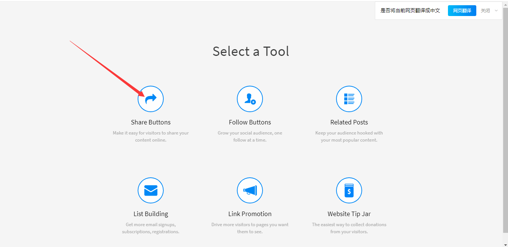
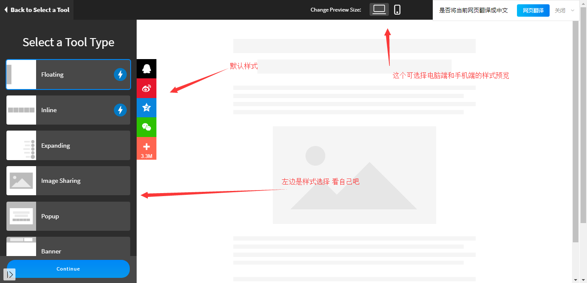
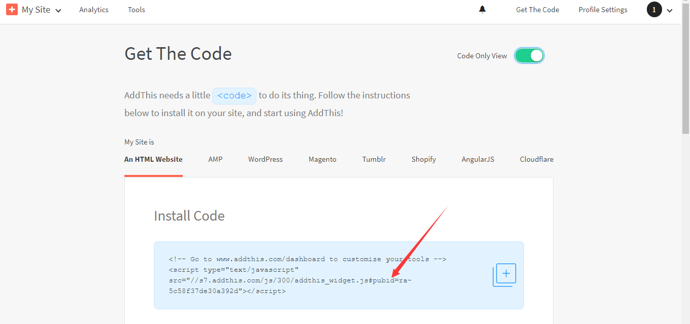

   老早就想系统的优化博客了，评论，打赏等等功能都很简单，试了一次就成功了。这次想弄出分享功能，很无语弄了一天，最开始百度使用[ShareSDK](https://link.jianshu.com/?t=http://sharesdk.mob.com)，[参考](https://www.jianshu.com/p/bc3bcc294a0a)。不说了啥都检查过了没用没有效果！！ 醉了，这个很多开发文档，提供参考。可以不管用啊!!尼玛！老子换！
   经过不断测试以及百度。首先，主题next默认就支持的分享组件在你的next路径\layout\_partials\share文件夹下 ，得到信息默认支持多说、百度、addthis、jiathis、sharesdk等等，最开始我使用的是addthis这个玩意需要科学上网进行注册，说实话生成的样式多，好看，但毕竟也是国外的，配置好了进行分享却是404，找不出问题，很困惑。[addthis官网](https://www.addthis.com/)，因为是属于next默认支持的，配置非常简单，在next配置文件_config.xml搜索add_this_id，去官网注册后，点击
   然后点击
   选择样式然后选择要展示的分享链接，点击Activate Tool
   复制pubid后的字符
   将这个字符复制到hexo配置文件_config.xml里的add_this_id ,顺手将其注释取消,配置完成，不行！！！样式都出来了，分享出的链接404！！！！垃圾玩意cnm！！！！好吧试试别的！
   经过查阅jiathis、duoshuo都已经没用了，所以我使用baidu的，这个国内的分享还是没得毛病的，配置成功，样式很丑需要优化，功能没毛病，[参考](https://asdfv1929.github.io/2018/05/25/baidu-share/)。